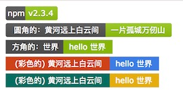

# shields-less


 []()  



## Features

[see online demo](https://wdd.js.org/shields-less/example/)

- no dependencies
- very small
- support chinese character
- support custom colors
- support node and browser

## Install

```
npm install shields-less
```

## Usage

```
var shieldsLess = require('shields-less')
var svgBadge = shieldsLess.svg({
    leftText: 'npm 黄河远上白云间',
    rightText: 'hello 世界'
})

var svgBadge2 = shieldsLess.svg({
    leftText: 'npm 黄河远上白云间',
    rightText: 'hello 世界',
    style: 'square'
})

var svgBadge2 = shieldsLess.svg({
    leftText: 'npm 黄河远上白云间',
    rightText: 'hello 世界',
    leftColor: '#e64a19',
    rightColor: '#448aff',
    style: 'square' // jest two style: square and plat(default)
})
```

**then you will get svg string**

```
<svg xmlns="http://www.w3.org/2000/svg" width="188" height="20">
    <rect width="188" height="20" fill="#555"/>
    <rect x="118" width="70" height="20" fill="#97CA00"/>
    <rect x="118" width="4" height="20" fill="#97CA00"/>
    <rect width="188" height="20" fill-opacity=".1"/>
    <g fill="#fff" text-anchor="middle" font-family="DejaVu Sans,Verdana,Geneva,sans-serif" font-size="11">
        <text x="60" y="14">npm 黄河远上白云间</text>
        <text x="152" y="14">hello 世界</text>
    </g>
    </svg>
```